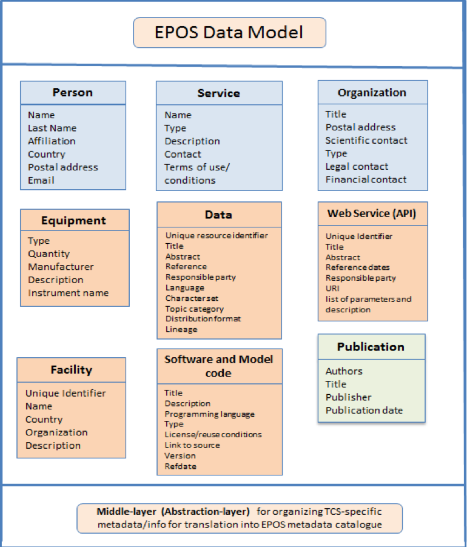
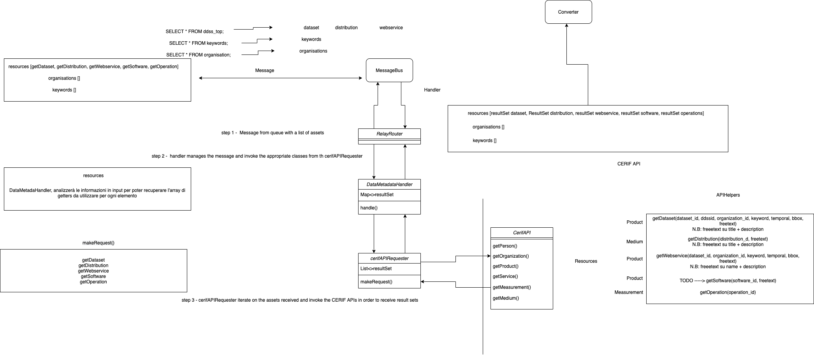

# Data Metadata Service

  

## Introduction


This document discusses the Data Metadata Service component, which is the main access point to the Metadata Catalogue. This service handle request received from modules that need to be executed on the catalogue.


## Module Description

### Overview

The purpose of the Data Metadata Service is to provide access to the Metadata Catalogue for all other modules of the ICS-C.
The module consists of two submodules:

* **Module Handler**
* **CERIF API**

**Module Handler** provides an interface on the message bus through the use of the RoutingFramework, manages the input messages and translates the payload into requests on functions called "Helpers" provided by the CERIF API.

**CERIF API** provides functions to easily communicate with the Metadata Catalogue CERIF, they provide also "Helpers" which are functions modelled on top of the EPOS Baseline (D. 7.4)


  

### Reference EPOS Baseline




### Diagram



src: https://app.diagrams.net/#G18YXI0jE4DLDTKGJtKJ42k07G6lZ3wW0E

### Input Structure

```
{
    "entities": [{
        "name": "entityName",
        "parameters": {
            "paramName": "paramValue",
            "paramNameArray": ["paramValue"]
        }
    }]
}
```

### Output Structure

```
{
    "entities": [{
        "name": "entityName",
        "parameters": {
            "paramName": "paramValue",
            "paramNameArray": ["paramValue"]
        },
        "resultset": []
    }]
}
```

### Description


  

  

## Logging

Logging support is provided by the log4j2 library via the SLF4J facade library.

Two log configurations are included for developers:

* the default log4j2.xml

* and the log4j2-with-file-appender.xml (which the developer can enable if they wish to capture log files during development)

  

In production it is expected that the host infrastructure will override the above log configuration with one that is under the control of the operations team, this is achieved via the command line argument "-Dlog4j.configurationFile=/etc/log4j2/log4j2.properties" located in the "Dockerfile".
